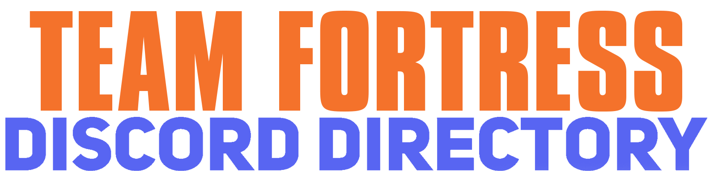

A curated collection of Team Fortress 2 Discord server invite links organized by community type, with helpful descriptions to detail what the community is focused on.

Click any invite link to join that server. If a server is missing from the directory, or a link has expired, please submit an issue here on [Github.](https://github.com/7eventy7/Team-Fortress-Discord-Directory/issues)

# Server Categories 

## [⚡ → General Communities](communities/general.md)
> *General gameplay, finding teammates, and social hangouts*

## [🌍 → Regional Communities](communities/regional.md)
> *Location-based servers and different languages*

## [🎨 → Maker Communities](communities/makers.md)
> *Mappers, modders, and TF2 development*

## [⚙️ → Configuration Communities](communities/configuration.md)
> *Configs, customizations, and more*

## [📐 → HUD Communities](communities/huds.md)
> *UI development, customization, and support*

## [🏆 → Competitive Communities](communities/competitive.md)
> *Leagues, scrims, and competitive play*

## [🎬 → Creator Communities](communities/creators.md)
> *Content creators, video discussions, and fan communities*

## [💰 → Trading Communities](communities/trading.md)
> *Item trading, market discussions, and economy talk*

---

### Disclosure
This directory is not affiliated with Valve Corporation. All server invites are provided by their respective communities. 
If your server is listed in the directory and you wish for it to be removed, please submit an issue. 
I do not endorse, and am not responsible for the content inside of these servers.